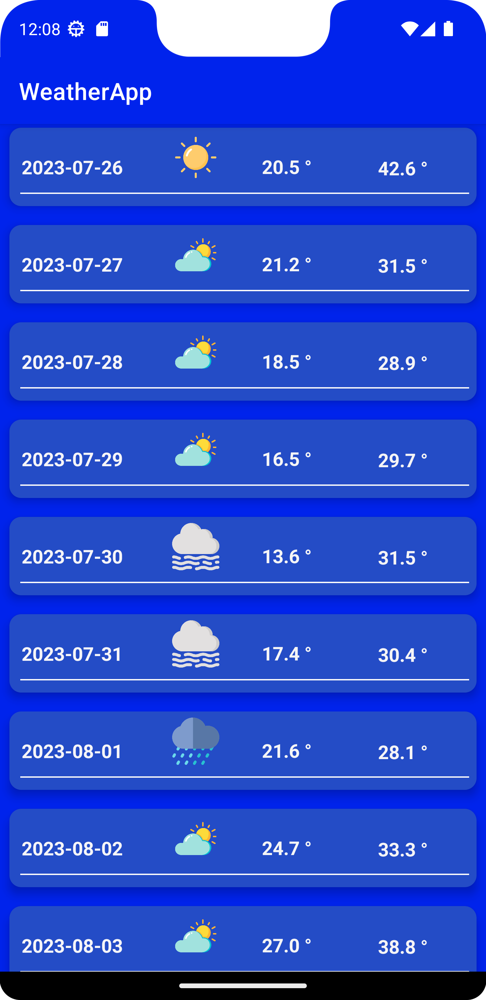
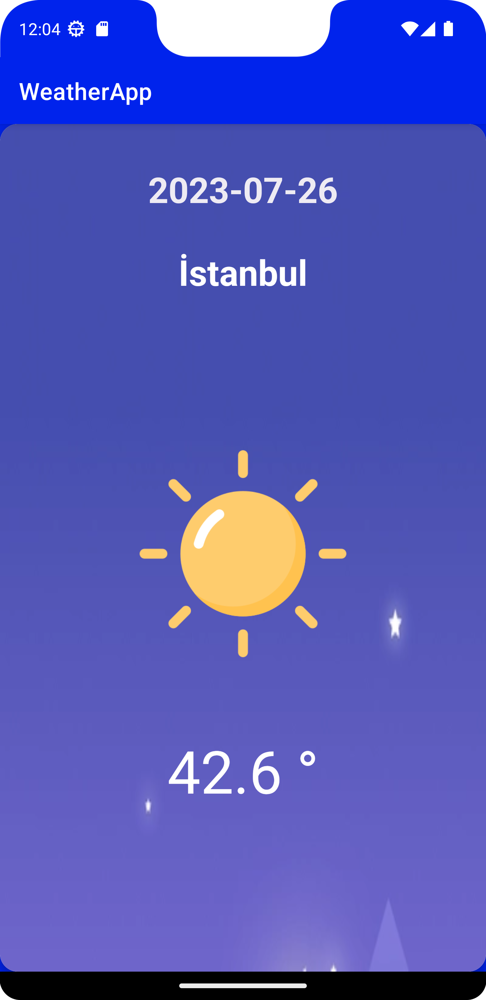

# WeatherApp

Weather App is an application where you can see today's weather and 14 days weather. And also yo can see detail weather data of each day.

***API:***  https://api.open-meteo.com/

# Libraries Used

+ MVVM Architecture
+ [Hilt](https://developer.android.com/jetpack/compose/libraries#hilt)
+ [Room](https://developer.android.com/training/data-storage/room)
+ [Navigation Component](https://developer.android.com/guide/navigation/navigation-getting-started)
+ [ViewModel](https://developer.android.com/topic/libraries/architecture/viewmodel#implement)
+ [Coroutines](https://developer.android.com/kotlin/coroutines)
+ [Flow](https://developer.android.com/kotlin/flow)
+ [Repositories](https://developer.android.com/topic/architecture#data-layer)
+ [LiveData](https://developer.android.com/topic/libraries/architecture/livedata)
+ [Firebase Crashlytics](https://firebase.google.com/docs/crashlytics)
+ [Firebase Cloud Messaging](https://firebase.google.com/docs/cloud-messaging)
+ ***Third party libraries***
  - [Retrofit](https://square.github.io/retrofit/)
  - [OkHttp](https://square.github.io/okhttp/recipes/)
  - [Gson](https://github.com/google/gson)

# Output
| Home Screen | Detail Screen |
| --- | --- | 
|   |  | 
